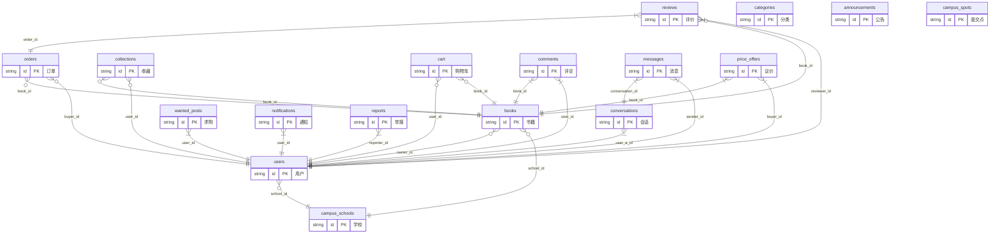

# 第 3 章 数据库设计

> 自动生成，数据源：`models.py`（SQLAlchemy ORM）  
> 配套：[项目报告](./项目报告.md) · [技术栈与原理](./技术栈与原理.md) · [文档索引](./README.md)

## 3.1 数据库概念设计

系统核心实体及关系如下（E-R 图）：



**实体说明**：用户（users）发布书籍（books）、下单（orders）、收藏（collections）、评论（comments）、私信（messages）；书籍归属用户与学校（campus_schools）；订单关联买卖双方与书籍；会话（conversations）承载消息与面交预约。

## 3.2 数据库逻辑设计

共 **30** 张数据表，字段类型以 SQLite/MySQL 通用写法表示。

### 表 admin_audit_logs（管理员操作日志）

| 字段 | 数据类型 | 备注 |
|------|----------|------|
| id | VARCHAR(50) | 主键 |
| admin_id | VARCHAR(50) | 外键→users.id ON DELETE RESTRICT；非空；索引 |
| admin_name | VARCHAR(100) | - |
| action | VARCHAR(80) | 索引 |
| target_type | VARCHAR(40) | - |
| target_id | VARCHAR(50) | - |
| detail | TEXT | - |
| ip | VARCHAR(50) | - |
| created_at | VARCHAR(50) | - |

### 表 announcements（系统公告表）

| 字段 | 数据类型 | 备注 |
|------|----------|------|
| id | VARCHAR(50) | 主键 |
| title | VARCHAR(200) | 非空 |
| content | TEXT | 非空 |
| type | VARCHAR(30) | 默认='guide' |
| is_active | BOOLEAN | 索引；默认=True |
| created_at | VARCHAR(50) | - |
| updated_at | VARCHAR(50) | - |

### 表 ban_appeals（封禁申诉）

| 字段 | 数据类型 | 备注 |
|------|----------|------|
| id | VARCHAR(50) | 主键 |
| user_id | VARCHAR(50) | 外键→users.id ON DELETE CASCADE；非空；索引 |
| username | VARCHAR(100) | - |
| ban_level | VARCHAR(20) | - |
| content | TEXT | 非空 |
| status | VARCHAR(20) | 索引；默认='pending' |
| admin_reply | TEXT | - |
| handled_by | VARCHAR(50) | 外键→users.id ON DELETE SET NULL |
| created_at | VARCHAR(50) | - |
| updated_at | VARCHAR(50) | - |

### 表 book_views（书籍浏览记录）

| 字段 | 数据类型 | 备注 |
|------|----------|------|
| id | VARCHAR(50) | 主键 |
| book_id | VARCHAR(50) | 外键→books.id ON DELETE CASCADE；非空；索引 |
| user_id | VARCHAR(50) | 外键→users.id ON DELETE SET NULL；索引；默认='' |
| created_at | VARCHAR(50) | - |

### 表 books（书籍表）

| 字段 | 数据类型 | 备注 |
|------|----------|------|
| id | VARCHAR(50) | 主键 |
| title | VARCHAR(200) | 非空；索引 |
| author | VARCHAR(100) | - |
| category | VARCHAR(50) | 索引 |
| price | REAL | 非空 |
| desc | TEXT | - |
| description | TEXT | - |
| imgs | TEXT | - |
| image | VARCHAR(500) | - |
| cover_url | VARCHAR(500) | - |
| contact | VARCHAR(200) | - |
| stock | INTEGER | 默认=1 |
| status | VARCHAR(20) | 索引；默认='available' |
| owner_id | VARCHAR(50) | 外键→users.id ON DELETE SET NULL；索引 |
| owner_name | VARCHAR(100) | - |
| seller | VARCHAR(100) | - |
| sellerId | VARCHAR(50) | 外键→users.id ON DELETE SET NULL |
| createTime | VARCHAR(50) | - |
| created_at | VARCHAR(50) | - |
| updated_at | VARCHAR(50) | - |
| publish_date | VARCHAR(50) | - |
| condition | VARCHAR(50) | - |
| isbn | VARCHAR(30) | 索引 |
| edition | VARCHAR(80) | - |
| course_code | VARCHAR(50) | 索引 |
| campus_zone | VARCHAR(100) | - |
| dorm_building | VARCHAR(50) | 索引 |
| campaign_tag | VARCHAR(50) | 索引 |
| original_price | REAL | - |
| price_drop_until | VARCHAR(50) | - |
| price_drop_plan | TEXT | - |
| listing_type | VARCHAR(20) | 默认='single' |
| bundle_items | TEXT | - |
| view_count | INTEGER | 默认=0 |
| school_id | VARCHAR(50) | 外键→campus_schools.id ON DELETE SET NULL；索引 |

### 表 campus_schools（多校配置）

| 字段 | 数据类型 | 备注 |
|------|----------|------|
| id | VARCHAR(50) | 主键 |
| name | VARCHAR(200) | 非空 |
| email_domains | TEXT | - |
| is_active | BOOLEAN | 索引；默认=True |
| sort_order | INTEGER | 默认=0 |
| created_at | VARCHAR(50) | - |

### 表 campus_spots（校内面交点）

| 字段 | 数据类型 | 备注 |
|------|----------|------|
| id | VARCHAR(50) | 主键 |
| name | VARCHAR(100) | 非空 |
| zone | VARCHAR(50) | 默认='西校区' |
| description | VARCHAR(300) | - |
| sort_order | INTEGER | 默认=0 |
| map_x | REAL | - |
| map_y | REAL | - |
| created_at | VARCHAR(50) | - |

### 表 cart（购物车表）

| 字段 | 数据类型 | 备注 |
|------|----------|------|
| id | VARCHAR(50) | 主键 |
| user_id | VARCHAR(50) | 外键→users.id ON DELETE CASCADE；索引 |
| book_id | VARCHAR(50) | 外键→books.id ON DELETE CASCADE；索引 |
| quantity | INTEGER | 默认=1 |
| created_at | VARCHAR(50) | - |
| updated_at | VARCHAR(50) | - |

### 表 categories（书籍分类表）

| 字段 | 数据类型 | 备注 |
|------|----------|------|
| id | VARCHAR(50) | 主键 |
| code | VARCHAR(50) | 非空；唯一；索引 |
| name | VARCHAR(100) | 非空 |
| sort_order | INTEGER | 默认=0 |
| created_at | VARCHAR(50) | - |

### 表 collections（收藏表）

| 字段 | 数据类型 | 备注 |
|------|----------|------|
| id | VARCHAR(50) | 主键 |
| book_id | VARCHAR(50) | 外键→books.id ON DELETE CASCADE；索引 |
| user_id | VARCHAR(50) | 外键→users.id ON DELETE CASCADE；索引 |
| username | VARCHAR(100) | - |
| collected_price | REAL | - |
| price_alert | BOOLEAN | 默认=True |
| created_at | VARCHAR(50) | - |

唯一约束：`unique_user_book_collection`（book_id, user_id）

### 表 comments（书籍评论表）

| 字段 | 数据类型 | 备注 |
|------|----------|------|
| id | VARCHAR(50) | 主键 |
| book_id | VARCHAR(50) | 外键→books.id ON DELETE CASCADE；非空；索引 |
| book_title | VARCHAR(200) | - |
| user_id | VARCHAR(50) | 外键→users.id ON DELETE CASCADE；非空；索引 |
| username | VARCHAR(100) | - |
| content | TEXT | 非空 |
| likes | INTEGER | 默认=0 |
| is_deleted | BOOLEAN | 索引；默认=False |
| audit_status | VARCHAR(20) | 索引；默认='approved' |
| created_at | VARCHAR(50) | - |

### 表 conversations（私信会话表）

| 字段 | 数据类型 | 备注 |
|------|----------|------|
| id | VARCHAR(50) | 主键 |
| user_a_id | VARCHAR(50) | 外键→users.id ON DELETE CASCADE；非空；索引 |
| user_b_id | VARCHAR(50) | 外键→users.id ON DELETE CASCADE；非空；索引 |
| book_id | VARCHAR(50) | 默认='' |
| order_id | VARCHAR(50) | 默认='' |
| book_title | VARCHAR(200) | - |
| last_preview | VARCHAR(300) | - |
| updated_at | VARCHAR(50) | - |
| created_at | VARCHAR(50) | - |

唯一约束：`unique_conversation_ctx`（user_a_id, user_b_id, book_id, order_id）

### 表 course_textbooks（课程-教材映射）

| 字段 | 数据类型 | 备注 |
|------|----------|------|
| id | VARCHAR(50) | 主键 |
| college | VARCHAR(100) | 索引 |
| major | VARCHAR(100) | 索引 |
| course_code | VARCHAR(50) | 索引 |
| course_name | VARCHAR(200) | - |
| textbook_title | VARCHAR(200) | - |
| textbook_author | VARCHAR(100) | - |
| textbook_isbn | VARCHAR(30) | - |
| created_at | VARCHAR(50) | - |

### 表 isbn_blacklist（违禁/盗版 ISBN 黑名单）

| 字段 | 数据类型 | 备注 |
|------|----------|------|
| id | VARCHAR(50) | 主键 |
| isbn | VARCHAR(30) | 非空；唯一；索引 |
| reason | TEXT | - |
| created_at | VARCHAR(50) | - |

### 表 meeting_appointments（面交预约表）

| 字段 | 数据类型 | 备注 |
|------|----------|------|
| id | VARCHAR(50) | 主键 |
| conversation_id | VARCHAR(50) | 外键→conversations.id ON DELETE CASCADE；非空；索引 |
| order_id | VARCHAR(50) | 默认='' |
| book_id | VARCHAR(50) | 默认='' |
| proposer_id | VARCHAR(50) | 外键→users.id ON DELETE CASCADE；非空；索引 |
| place | VARCHAR(200) | 非空 |
| meeting_time | VARCHAR(50) | 非空 |
| note | TEXT | - |
| status | VARCHAR(20) | 索引；默认='pending' |
| created_at | VARCHAR(50) | - |
| updated_at | VARCHAR(50) | - |

### 表 messages（私信消息表）

| 字段 | 数据类型 | 备注 |
|------|----------|------|
| id | VARCHAR(50) | 主键 |
| conversation_id | VARCHAR(50) | 外键→conversations.id ON DELETE CASCADE；非空；索引 |
| sender_id | VARCHAR(50) | 外键→users.id ON DELETE CASCADE；非空；索引 |
| sender_name | VARCHAR(100) | - |
| msg_type | VARCHAR(20) | 默认='text' |
| content | TEXT | - |
| media_url | VARCHAR(500) | - |
| media_meta | TEXT | - |
| appointment_id | VARCHAR(50) | - |
| is_read | BOOLEAN | 索引；默认=False |
| read_at | VARCHAR(50) | - |
| is_recalled | BOOLEAN | 索引；默认=False |
| recalled_at | VARCHAR(50) | - |
| created_at | VARCHAR(50) | - |

### 表 notification_outbox（邮件/短信推送记录（模拟通道，便于审计））

| 字段 | 数据类型 | 备注 |
|------|----------|------|
| id | VARCHAR(50) | 主键 |
| user_id | VARCHAR(50) | 外键→users.id ON DELETE CASCADE；非空；索引 |
| channel | VARCHAR(20) | 索引 |
| recipient | VARCHAR(200) | - |
| title | VARCHAR(200) | - |
| content | TEXT | - |
| status | VARCHAR(20) | 默认='sent' |
| created_at | VARCHAR(50) | - |

### 表 notifications（站内通知表）

| 字段 | 数据类型 | 备注 |
|------|----------|------|
| id | VARCHAR(50) | 主键 |
| user_id | VARCHAR(50) | 外键→users.id ON DELETE CASCADE；非空；索引 |
| ntype | VARCHAR(30) | 索引 |
| title | VARCHAR(200) | 非空 |
| content | TEXT | - |
| link | VARCHAR(300) | - |
| is_read | BOOLEAN | 索引；默认=False |
| created_at | VARCHAR(50) | - |

### 表 orders（订单表）

| 字段 | 数据类型 | 备注 |
|------|----------|------|
| id | VARCHAR(50) | 主键 |
| book_id | VARCHAR(50) | 外键→books.id ON DELETE SET NULL；索引 |
| book_title | VARCHAR(200) | - |
| buyer_id | VARCHAR(50) | 外键→users.id ON DELETE SET NULL；索引 |
| buyer_name | VARCHAR(100) | - |
| seller_id | VARCHAR(50) | 外键→users.id ON DELETE SET NULL；索引 |
| seller_name | VARCHAR(100) | - |
| price | REAL | - |
| status | VARCHAR(20) | 索引；默认='pending' |
| cancel_reason | VARCHAR(300) | - |
| order_type | VARCHAR(20) | 索引；默认='sale' |
| exchange_book_title | VARCHAR(200) | - |
| exchange_note | TEXT | - |
| created_at | VARCHAR(50) | - |

### 表 price_offers（议价报价表）

| 字段 | 数据类型 | 备注 |
|------|----------|------|
| id | VARCHAR(50) | 主键 |
| book_id | VARCHAR(50) | 外键→books.id ON DELETE CASCADE；非空；索引 |
| book_title | VARCHAR(200) | - |
| buyer_id | VARCHAR(50) | 外键→users.id ON DELETE CASCADE；非空；索引 |
| buyer_name | VARCHAR(100) | - |
| seller_id | VARCHAR(50) | 外键→users.id ON DELETE CASCADE；非空；索引 |
| offer_price | REAL | 非空 |
| list_price | REAL | - |
| message | TEXT | - |
| status | VARCHAR(20) | 索引；默认='pending' |
| created_at | VARCHAR(50) | - |

### 表 publish_templates（发布模板）

| 字段 | 数据类型 | 备注 |
|------|----------|------|
| id | VARCHAR(50) | 主键 |
| user_id | VARCHAR(50) | 外键→users.id ON DELETE CASCADE；非空；索引 |
| name | VARCHAR(100) | 非空 |
| payload | TEXT | - |
| created_at | VARCHAR(50) | - |

### 表 reports（举报）

| 字段 | 数据类型 | 备注 |
|------|----------|------|
| id | VARCHAR(50) | 主键 |
| reporter_id | VARCHAR(50) | 外键→users.id ON DELETE CASCADE；非空；索引 |
| reporter_name | VARCHAR(100) | - |
| target_type | VARCHAR(30) | 索引 |
| target_id | VARCHAR(50) | 非空；索引 |
| reason | TEXT | 非空 |
| status | VARCHAR(20) | 索引；默认='pending' |
| admin_note | TEXT | - |
| created_at | VARCHAR(50) | - |

### 表 reviews（订单评价表）

| 字段 | 数据类型 | 备注 |
|------|----------|------|
| id | VARCHAR(50) | 主键 |
| order_id | VARCHAR(50) | 外键→orders.id ON DELETE CASCADE；非空；索引 |
| book_id | VARCHAR(50) | 外键→books.id ON DELETE SET NULL；索引 |
| reviewer_id | VARCHAR(50) | 外键→users.id ON DELETE CASCADE；非空；索引 |
| reviewer_name | VARCHAR(100) | - |
| reviewer_role | VARCHAR(20) | - |
| reviewed_user_id | VARCHAR(50) | 外键→users.id ON DELETE SET NULL；索引 |
| description_rating | INTEGER | 默认=5 |
| service_rating | INTEGER | 默认=5 |
| condition_rating | INTEGER | 默认=5 |
| efficiency_rating | INTEGER | 默认=5 |
| review_content | TEXT | - |
| created_at | VARCHAR(50) | - |

唯一约束：`unique_order_reviewer_review`（order_id, reviewer_id）

### 表 semester_campaigns（学期主题活动）

| 字段 | 数据类型 | 备注 |
|------|----------|------|
| id | VARCHAR(50) | 主键 |
| title | VARCHAR(200) | 非空 |
| campaign_type | VARCHAR(30) | - |
| tag | VARCHAR(50) | 索引 |
| start_date | VARCHAR(20) | - |
| end_date | VARCHAR(20) | - |
| description | TEXT | - |
| is_active | BOOLEAN | 索引；默认=True |
| created_at | VARCHAR(50) | - |

### 表 sensitive_words（敏感词）

| 字段 | 数据类型 | 备注 |
|------|----------|------|
| id | VARCHAR(50) | 主键 |
| word | VARCHAR(100) | 非空；索引 |
| scope | VARCHAR(20) | 默认='all' |
| is_active | BOOLEAN | 索引；默认=True |
| created_at | VARCHAR(50) | - |

### 表 settings（系统设置表）

| 字段 | 数据类型 | 备注 |
|------|----------|------|
| id | INTEGER | 主键 |
| key | VARCHAR(100) | 非空；唯一 |
| value | TEXT | - |
| updated_at | VARCHAR(50) | - |

唯一约束：`uq_settings_key`（key）

### 表 user_blocks（用户拉黑）

| 字段 | 数据类型 | 备注 |
|------|----------|------|
| id | VARCHAR(50) | 主键 |
| blocker_id | VARCHAR(50) | 外键→users.id ON DELETE CASCADE；非空；索引 |
| blocked_id | VARCHAR(50) | 外键→users.id ON DELETE CASCADE；非空；索引 |
| created_at | VARCHAR(50) | - |

唯一约束：`unique_user_block`（blocker_id, blocked_id）

### 表 user_follows（关注卖家表）

| 字段 | 数据类型 | 备注 |
|------|----------|------|
| id | VARCHAR(50) | 主键 |
| follower_id | VARCHAR(50) | 外键→users.id ON DELETE CASCADE；非空；索引 |
| seller_id | VARCHAR(50) | 外键→users.id ON DELETE CASCADE；非空；索引 |
| created_at | VARCHAR(50) | - |

唯一约束：`unique_user_follow`（follower_id, seller_id）

### 表 users（用户表）

| 字段 | 数据类型 | 备注 |
|------|----------|------|
| id | VARCHAR(50) | 主键 |
| username | VARCHAR(100) | 非空；唯一；索引 |
| password | VARCHAR(255) | 非空 |
| email | VARCHAR(100) | - |
| phone | VARCHAR(20) | - |
| school | VARCHAR(200) | - |
| campus_zone | VARCHAR(100) | 默认='西校区' |
| dorm_building | VARCHAR(50) | - |
| introduction | TEXT | - |
| avatar | VARCHAR(500) | - |
| is_admin | BOOLEAN | 索引；默认=False |
| role | VARCHAR(20) | 索引；默认='student' |
| ban_level | VARCHAR(20) | 索引；默认='none' |
| ban_until | VARCHAR(50) | - |
| ban_reason | TEXT | - |
| notify_email | BOOLEAN | 默认=True |
| notify_sms | BOOLEAN | 默认=True |
| subscribe_price_drop | BOOLEAN | 默认=True |
| schedule_json | TEXT | - |
| no_show_count | INTEGER | 默认=0 |
| school_id | VARCHAR(50) | 外键→campus_schools.id ON DELETE SET NULL；索引 |
| student_id | VARCHAR(50) | - |
| campus_email | VARCHAR(120) | - |
| campus_verified | BOOLEAN | 索引；默认=False |
| created_at | VARCHAR(50) | - |
| updated_at | VARCHAR(50) | - |

### 表 wanted_posts（求购信息表）

| 字段 | 数据类型 | 备注 |
|------|----------|------|
| id | VARCHAR(50) | 主键 |
| user_id | VARCHAR(50) | 外键→users.id ON DELETE CASCADE；非空；索引 |
| username | VARCHAR(100) | - |
| title | VARCHAR(200) | 非空；索引 |
| author | VARCHAR(100) | - |
| isbn | VARCHAR(30) | 索引 |
| category | VARCHAR(50) | - |
| max_price | REAL | - |
| desc | TEXT | - |
| status | VARCHAR(20) | 索引；默认='open' |
| created_at | VARCHAR(50) | - |

## 3.3 数据库物理结构实现

数据库名：`campus_book_delivery`（SQLite 文件 `campus_book_delivery.db` 或 MySQL 库）。

建表通过 `db.create_all()` / `upgrade_db.py` / `alembic upgrade head` 执行。代表性 DDL 如下（非全部代码）：

```sql
CREATE TABLE users (
  id VARCHAR(50) NOT NULL PRIMARY KEY,
  username VARCHAR(100) NOT NULL,
  password VARCHAR(255) NOT NULL,
  email VARCHAR(100),
  phone VARCHAR(20),
  school VARCHAR(200),
  campus_zone VARCHAR(100),
  dorm_building VARCHAR(50),
  introduction TEXT,
  avatar VARCHAR(500),
  is_admin BOOLEAN,
  role VARCHAR(20),
  ban_level VARCHAR(20),
  ban_until VARCHAR(50),
  ban_reason TEXT,
  notify_email BOOLEAN,
  notify_sms BOOLEAN,
  subscribe_price_drop BOOLEAN,
  schedule_json TEXT,
  no_show_count INTEGER,
  school_id VARCHAR(50),
  student_id VARCHAR(50),
  campus_email VARCHAR(120),
  campus_verified BOOLEAN,
  created_at VARCHAR(50),
  updated_at VARCHAR(50),
  FOREIGN KEY (school_id) REFERENCES campus_schools(id) ON DELETE SET NULL
);

CREATE TABLE books (
  id VARCHAR(50) NOT NULL PRIMARY KEY,
  title VARCHAR(200) NOT NULL,
  author VARCHAR(100),
  category VARCHAR(50),
  price REAL NOT NULL,
  desc TEXT,
  description TEXT,
  imgs TEXT,
  image VARCHAR(500),
  cover_url VARCHAR(500),
  contact VARCHAR(200),
  stock INTEGER,
  status VARCHAR(20),
  owner_id VARCHAR(50),
  owner_name VARCHAR(100),
  seller VARCHAR(100),
  sellerId VARCHAR(50),
  createTime VARCHAR(50),
  created_at VARCHAR(50),
  updated_at VARCHAR(50),
  publish_date VARCHAR(50),
  condition VARCHAR(50),
  isbn VARCHAR(30),
  edition VARCHAR(80),
  course_code VARCHAR(50),
  campus_zone VARCHAR(100),
  dorm_building VARCHAR(50),
  campaign_tag VARCHAR(50),
  original_price REAL,
  price_drop_until VARCHAR(50),
  price_drop_plan TEXT,
  listing_type VARCHAR(20),
  bundle_items TEXT,
  view_count INTEGER,
  school_id VARCHAR(50),
  FOREIGN KEY (owner_id) REFERENCES users(id) ON DELETE SET NULL,
  FOREIGN KEY (sellerId) REFERENCES users(id) ON DELETE SET NULL,
  FOREIGN KEY (school_id) REFERENCES campus_schools(id) ON DELETE SET NULL
);

CREATE TABLE orders (
  id VARCHAR(50) NOT NULL PRIMARY KEY,
  book_id VARCHAR(50),
  book_title VARCHAR(200),
  buyer_id VARCHAR(50),
  buyer_name VARCHAR(100),
  seller_id VARCHAR(50),
  seller_name VARCHAR(100),
  price REAL,
  status VARCHAR(20),
  cancel_reason VARCHAR(300),
  order_type VARCHAR(20),
  exchange_book_title VARCHAR(200),
  exchange_note TEXT,
  created_at VARCHAR(50),
  FOREIGN KEY (book_id) REFERENCES books(id) ON DELETE SET NULL,
  FOREIGN KEY (buyer_id) REFERENCES users(id) ON DELETE SET NULL,
  FOREIGN KEY (seller_id) REFERENCES users(id) ON DELETE SET NULL
);

CREATE TABLE collections (
  id VARCHAR(50) NOT NULL PRIMARY KEY,
  book_id VARCHAR(50),
  user_id VARCHAR(50),
  username VARCHAR(100),
  collected_price REAL,
  price_alert BOOLEAN,
  created_at VARCHAR(50),
  FOREIGN KEY (book_id) REFERENCES books(id) ON DELETE CASCADE,
  FOREIGN KEY (user_id) REFERENCES users(id) ON DELETE CASCADE
);

CREATE TABLE messages (
  id VARCHAR(50) NOT NULL PRIMARY KEY,
  conversation_id VARCHAR(50) NOT NULL,
  sender_id VARCHAR(50) NOT NULL,
  sender_name VARCHAR(100),
  msg_type VARCHAR(20),
  content TEXT,
  media_url VARCHAR(500),
  media_meta TEXT,
  appointment_id VARCHAR(50),
  is_read BOOLEAN,
  read_at VARCHAR(50),
  is_recalled BOOLEAN,
  recalled_at VARCHAR(50),
  created_at VARCHAR(50),
  FOREIGN KEY (conversation_id) REFERENCES conversations(id) ON DELETE CASCADE,
  FOREIGN KEY (sender_id) REFERENCES users(id) ON DELETE CASCADE
);

```

**索引**：各表外键字段及常用查询字段（如 `books.status`、`orders.status`、`users.username`）已建索引。

**外键策略**：子表删除时 `CASCADE`（收藏/评论/消息等）或 `SET NULL`（书籍归属用户删除后保留记录）。
